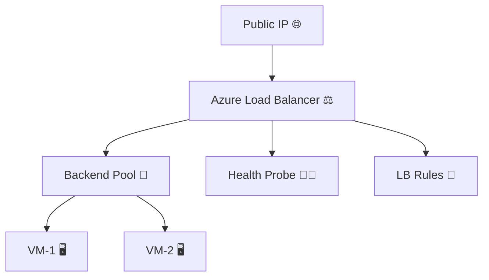

<p align="center">
  
</p>

---

## 🚀 Project Overview
This project provisions an **Azure Load Balancer** with **multiple VMs** using **Terraform (Modular structure)**.  
It follows best practices with **Key Vault integration**, **backend pools**, **health probes**, and **VM association**.

---

## 🏗️ Infrastructure Architecture (3D Styled)


---

## ✨ Key Features
- 🔹 Modularized Terraform code (`VM`, `Subnet`, `LoadBalancer`, `Backend Pool`, `Association`)
- 🔹 Azure **Key Vault** for storing sensitive secrets
- 🔹 Auto **VM-to-LoadBalancer association**
- 🔹 **Health Probes** for VM status check
- 🔹 **Load Balancer Rules** for traffic distribution
- 🔹 Fully reusable **Terraform Modules**

---

## 📂 Folder Structure
```
azure_loadbalancer/
│── Env/
│   ├── main.tf
│   ├── provider.tf
│── Modules/
│   ├── vm/
│   ├── subnet/
│   ├── bastion/
│   ├── loadbalancer/
│   ├── load-association/
│   ├── backend-pool/
│   ├── keyvault/
│── resource/
│── public-ip/
```

---

## ⚡ Usage

```bash
# Initialize Terraform
terraform init

# Validate configuration
terraform validate

# Plan the deployment
terraform plan

# Apply infrastructure
terraform apply -auto-approve
```

---

## 🔑 Example Variables

```hcl
variable "rg-name" {
  default = "tushar-rg"
}

variable "location" {
  default = "West Europe"
}

variable "lb-name" {
  default = "tushar-lb"
}

variable "vn-name" {
  default = "tushar-vnet"
}
```

---

## 📊 Tech Stack
<p align="center">
  
</p>

---

## 📈 Project Status
✅ Successfully deployed **Azure Load Balancer + 2 VMs** with modular Terraform  
✅ Backend Pool + Health Probe working fine  
✅ Code pushed to **GitHub repo** for reusability  

---

## 🤝 Contributing
Pull requests are welcome! For major changes, open an issue first to discuss what you would like to change.  

---

<p align="center">
  
</p>
